# Package State Machine

## Diagram

```mermaid
stateDiagram-v2
    [*] --> Queued
    Queued --> Research: S assigns scope
    Research --> Planned: P writes workcard
    Planned --> Implementing: S accepts scope
    Implementing --> Reviewed: E completes + checks
    Reviewed --> Implementing: RV advisory finding; E corrects
    Reviewed --> Promoted: RV accepts; S records evidence
    Implementing --> Leaf: defect found; S opens leaf
    Leaf --> Implementing: leaf resolved; return to parent
    Research --> Blocked: prerequisite unavailable
    Planned --> Blocked: prerequisite unavailable
    Implementing --> Blocked: stuck / material revision needed
    Blocked --> Research: S resumes after condition resolved
    Blocked --> Stuck: 3+ failed attempts
    Stuck --> Research: human injects reset directive
```

## States

| State | Meaning |
| --- | --- |
| **Queued** | The package is in S's queue, waiting to be dispatched. |
| **Research** | R is gathering current-source facts, environment inventory, and external-owner evidence. R may run commands against the target environment. |
| **Planned** | P has written or revised the workcard from R's evidence. The workcard is ready for S's acceptance. |
| **Implementing** | E is executing the workcard: writing code, running tests, performing the declared smoke. |
| **Reviewed** | E has completed. RV has reviewed the diff and evidence. Findings are advisory. |
| **Promoted** | S has recorded the gate record with RV acceptance. Dependents are unlocked. Terminal for this package. |
| **Leaf** | A defect or sub-problem was found during Implementing. S opened a leaf (a temporary, self-contained R→P→E→RV→S sequence). The parent package is paused. |
| **Blocked** | A prerequisite is unavailable (external service down, dependency not ready, environment broken). S will resume when the condition is resolved. |
| **Stuck** | 3+ failed attempts for the same underlying reason. Human intervention is required. S stops and requests a reset directive. |

## Transitions

### Normal flow

`Queued → Research → Planned → Implementing → Reviewed → Promoted`

This is the happy path. Each transition is triggered by the completion of the previous role's mandate.

### Review correction loop

`Reviewed → Implementing` (RV advisory finding; E corrects)

RV's findings are advisory. S reads the findings and decides which to act on. If S accepts a finding, E corrects it and the package returns to `Reviewed`. This loop should not exceed 2 iterations. If it does, S should escalate or re-plan.

### Leaf creation

`Implementing → Leaf → Implementing`

When E encounters a defect that blocks the parent package (e.g., a broken dependency, a test environment failure), S opens a leaf. The leaf runs its own R→P→E→RV→S sequence. When the leaf is resolved, the parent package returns to `Implementing`.

**Key constraint:** a leaf is for a *specific, bounded defect*. It is not a general-purpose "let's investigate this" mechanism. If the "defect" is actually the normal state of the test environment (e.g., a broken CNI that just needs a restart), the correct action is to fix the environment, not to open a leaf. See [`05-leaf-creation.md`](05-leaf-creation.md).

### Blocked state

`{Research, Planned, Implementing} → Blocked → Research`

A package enters `Blocked` when a prerequisite is unavailable. S records the exact condition and the evidence that it is blocked. When the condition is resolved (e.g., an external service comes back up), S transitions the package back to `Research` to re-verify the current state.

### Stuck state (3-strike rule)

`Blocked → Stuck → Research`

If a package or leaf fails 3 times for the same underlying reason (e.g., the same environment defect blocks 3 consecutive attempts), S transitions the package to `Stuck`. In this state:

- S stops dispatching roles for this package.
- S records the 3 failure attempts, the common root cause, and the specific reset that is needed.
- S requests human intervention. The human injects a reset directive (see [`templates/prompts/reset-directive.md`](../templates/prompts/reset-directive.md)).
- After the reset directive is applied, the package returns to `Research` with a fresh posture.

The 3-strike rule exists to prevent infinite loops. In the Terra supervisor incident (see [`notes/2026-09-30-supervisor-strictness-incident.md`](../notes/2026-09-30-supervisor-strictness-incident.md)), the same cluster network defect triggered 5 separate leaves before the root cause was addressed. The 3-strike rule would have triggered after the 3rd leaf.

## The Observer (not in the state machine)

The Observer (O) is a parallel, human-triggered role that reads gate records and produces plain-English summaries. It is not a state in the state machine. It does not block, modify, or intervene. It runs in a separate session and is invoked by the human user when they want to understand what is happening.

The Observer can be auto-triggered on a schedule (e.g., every 2-3 hours) as a background check, but its primary use is on-demand. See [`02-role-contracts/observer.md`](02-role-contracts/observer.md).

## Notes on the "bounded" language

Earlier versions of this state machine used the phrase "S accepts bounded scope." The word "bounded" was removed because it contributed to the over-restriction problem: supervisors interpreted "bounded" as "as small as possible" and started shrinking scope unnecessarily. The correct language is "S accepts scope" — the scope is whatever the workcard declares, provided it preserves the parent plan's decisions and invariants.
